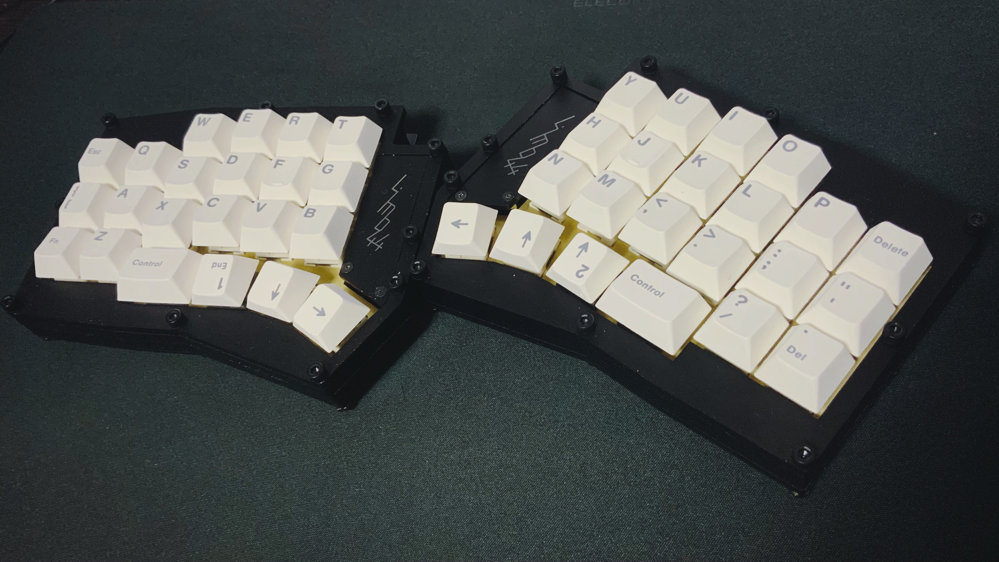

# Limb44
Limb44, a split keyboard with 3x6 column staggered keys and 4 thumb keys.

# Beryl32
Beryl32, a keyboard with 3x10 column staggered keys and 2 thumb keys.

Keyboard Maintainer: [yt3trees](https://github.com/yt3trees/)  [@yt3trees](https://twitter.com/yt3trees)
Firmware: [keyboards/limb44](https://github.com/yt3trees/qmk_firmware/tree/master/keyboards/limb44)
